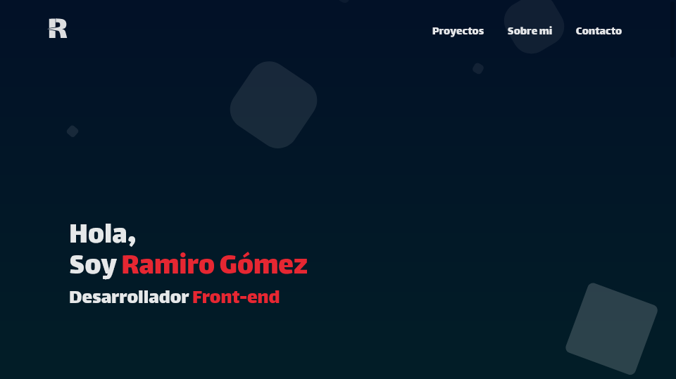

# Portfolio
Web construida con Create React App

### 🚀 [Pulsa aqui para ver una demo de la web](https://ramiro-gomez.netlify.app)


### Para iniciar un entorno de pruebas instala las dependencias de este proyecto con el comando:
```bash
npm install
# o
yarn install
```

### Y luego inicia el entorno de pruebas con:
```bash
npm start
# o
yarn start
```

### Si en cambio deseas generar un a version de produccion, instala las dependencias y luego utiliza:
```bash
npm run build
# o
yarn run build
```